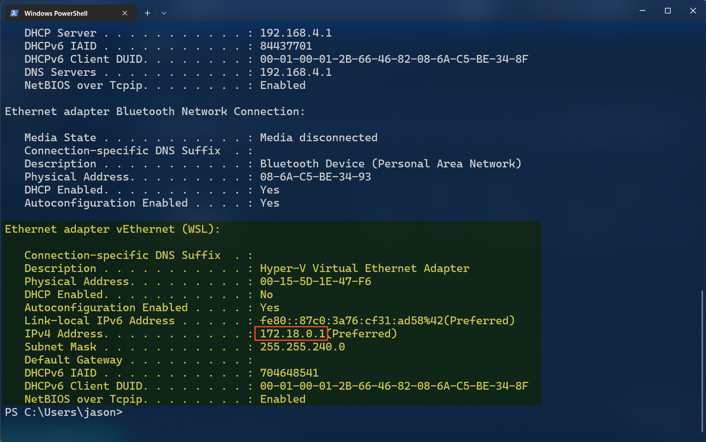
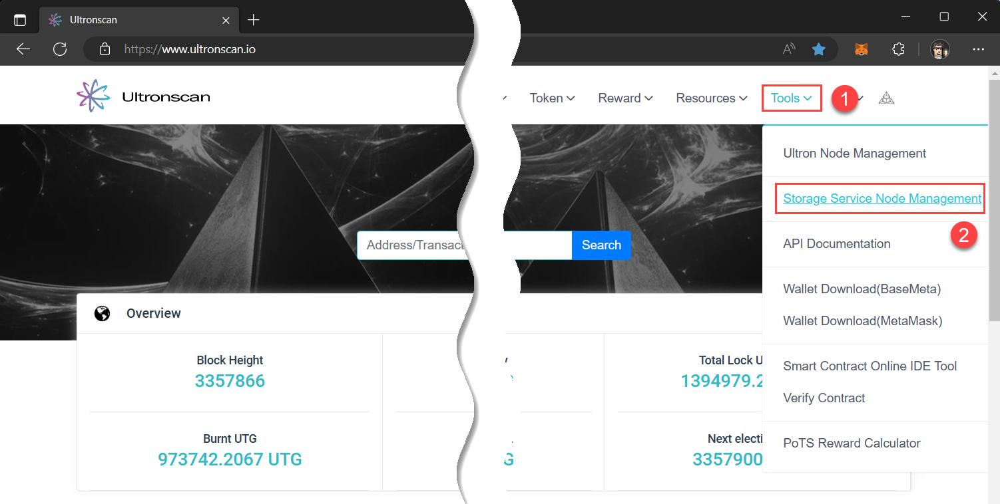
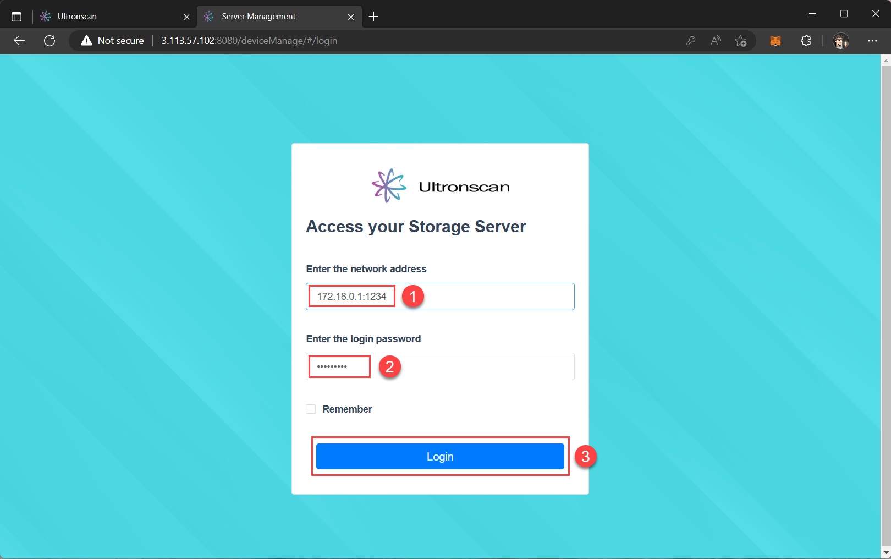
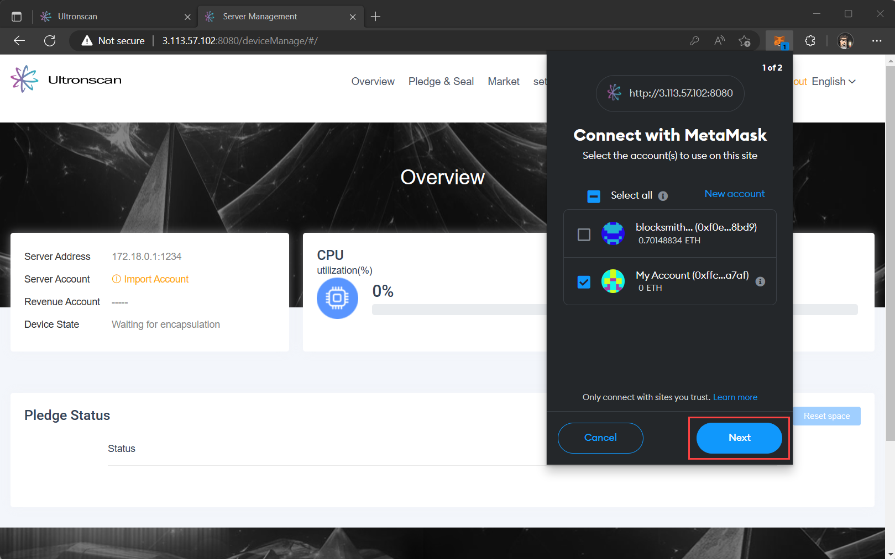
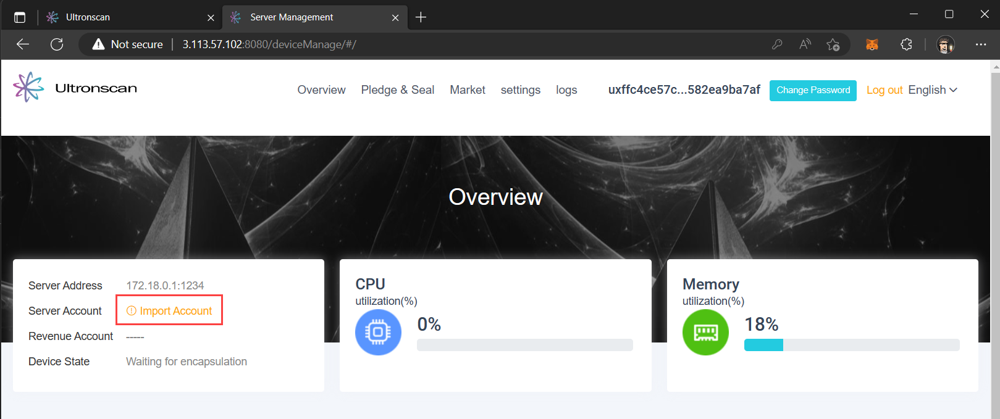
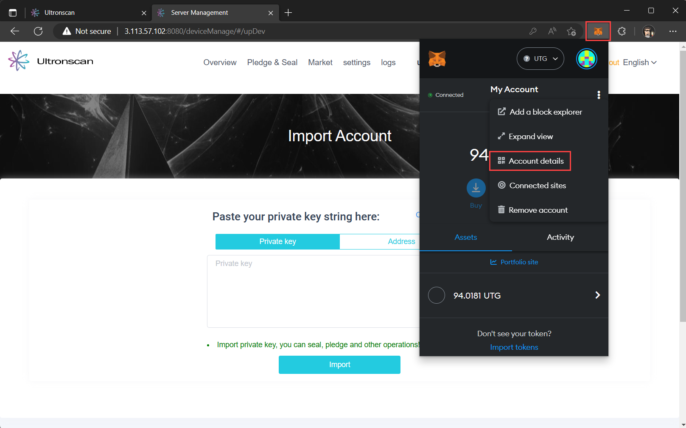
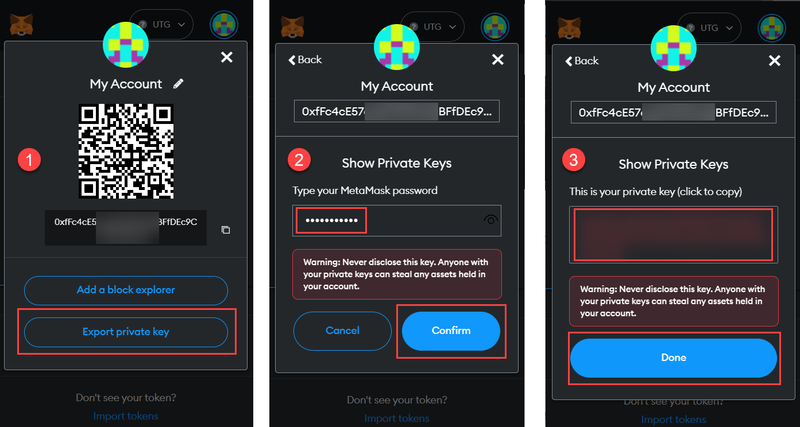
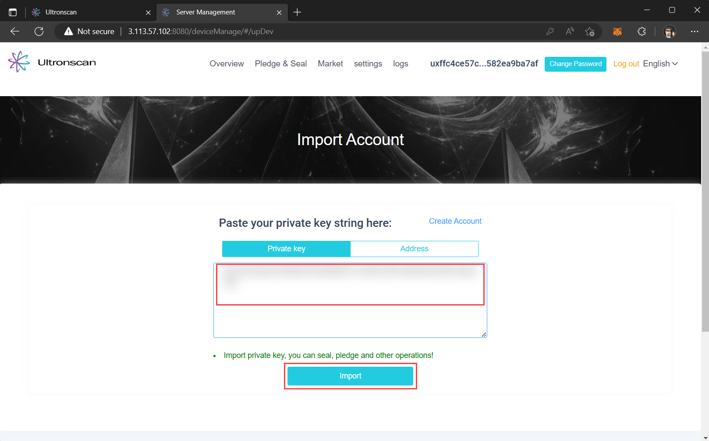
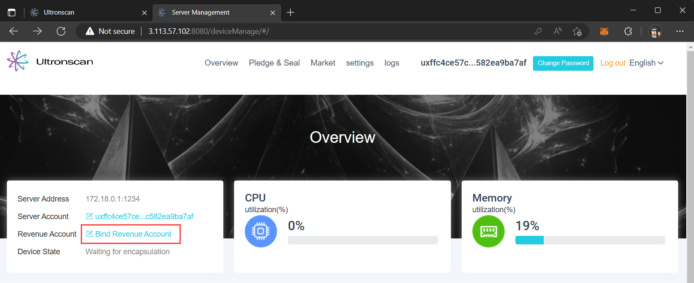
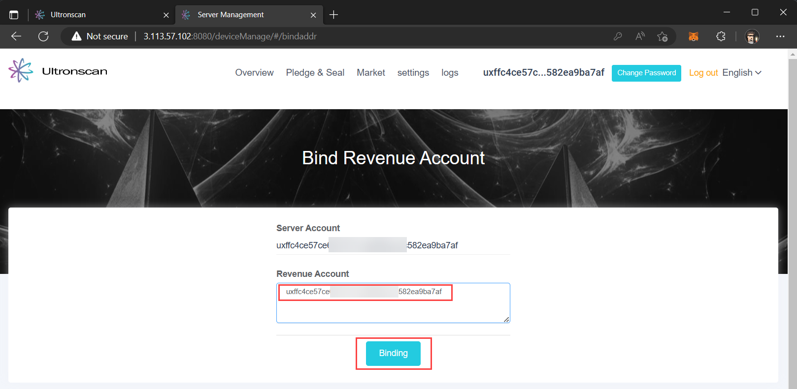

# Connecting to Ultronscan
---
[Ultronscan](https://www.ultronscan.io) is the block explorer for the [UltronGlow](https://www.ultronglow.io)
network, additionally providing a marketplace where users can provide and rent storage
from other UltronGlow users.

This guide provides instructions to connect the Docker container configured in the previous step to UltronScan,
which will allow you to rent your surplus storage to other users of the network.

## Prerequisites

* Complete the [Setting up your device](setting-up-your-device.md) tutorial.

## Steps

### 1. Get the IP address of your Docker Container

When connecting your Docker container to Ultronscan, you will need the IP address of the container
for the login operation.

1. Open the terminal application of your choice (in this example, we use Windows Terminal).
2. Type ```ipconfig /all``` in the terminal and press the **Enter** key.
3. After execution, ipconfig lists all network adapters, both physical and virtual, that are
   present in your system.  Scroll down to the virtual network adapter associated with your
   Docker container image (in this example, the ```Ethernet adapter vEthernet (WSL)```).
4. Copy the IP address listed, and save it for use in upcoming steps.



### 2. Connect MetaMask for Ultronscan

In order to perform actions in Ultronscan, you will need to connect your MetaMask wallet to the
Ultronscan website.  This will include logging into your Docker container from Ultronscan, using
the IP address from Step 1, and allowing MetaMask to connect to the site.

Navigate to [Ultronscan](https://www.ultronscan.io) with the same internet browser used to install MetaMask.

1. Click on **Tools** in top right corner of the Ultronscan website.

1. Click on **Storage Service Node Management**.



This will bring-up the login page to connect your Docker container to Ultronscan.

1. In the **Enter the network address** field, add the IP address you copied earlier in step 1
   followed by `:1234`(the port to access the server).

2. Don't change the default password (you can change it later).

3. Click the **Login** button.



This will bring up a MetaMask prompt asking you to connect your MetaMask account to this site.
Once connected, your MetaMask account will be associated with your Docker container and UltronScan.

1. Ensure you are connecting to the right account, and click the **Next** button.

2. Click the **Connect** button on the following MetaMask prompt.



There will be 2 following prompts from MetaMask which will add the UltronGlow network to MetaMask,
and switch you over to the new network to proceed with the following steps.

### 2. Configure your accounts on your server

Now that UltronScan is connected to your Docker Container (your server) through MetaMask, you can
now configure your server account for recieving UTG rewards.

1. In the Server Mangement page, click on **Import Account**.



The following page will ask for the private key to your MetaMask account to bind to your server.
Don't worry!  This hosted page is on your Docker Container and never leaves your server, so it's
safe.

1. Open the MetaMask extension in your browser and click **Account details**.



Three consecutive MetaMask prompts will appear.

1. Click **Export private key** in the first prompt.

2. In the second prompt, enter your MetaMask password and click **Confirm**.

3. Copy your private key to your clipboard, then click the **Done** button.



Paste your private key from the clipboard into the **Private key** field of the website.

:::caution

You should **never** share your private key with others or posting on public websites.  In this step, the server you
are connecting to in your browser is a website hosted by your Docker container.  As such, your private key is not leaving
your local network and is safe.

:::



Once completed, you'll see that your the `Server account` in the UltronScan website is associated with your MetaMask account.

Lastly, you need to bind a revenue account associated with where rental revenue will be received. Click on **Bind Revenue Account**.



Your revenue account can be the same as your server account, or you can choose a different account
if you like.

1. To use your server account as your revenue account, copy the address from the
   **Server Account** field and paste it into the **Revenue Account** field.

2. Click the **Binding** button.  A MetaMask prompt will appear to process the transaction.  Approve
   the transaction and you're done!



## Next Steps

Congratulations, you've successfully connected your server to MetaMask, configured your accounts,
and are now ready to start renting storage!  Continue on to the [**Next Step**](preparing-storage-for-rental.md)
to prepare your surplus storage for rental on the [UltronGlow Storage Market](https://www.ultronscan.io/market).