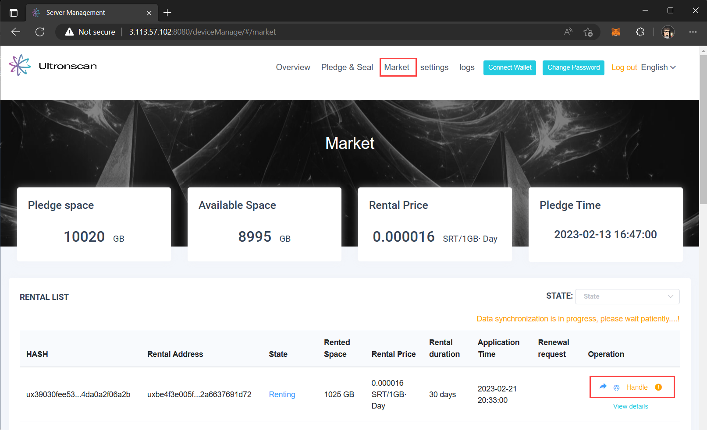
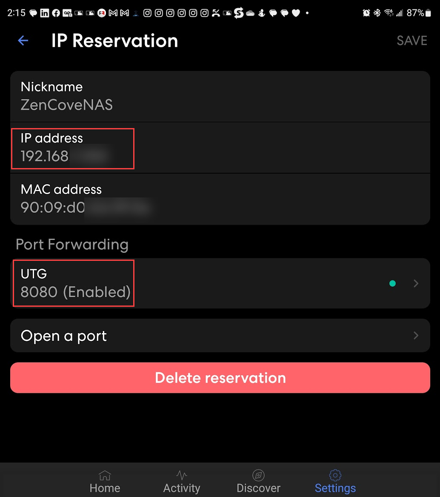
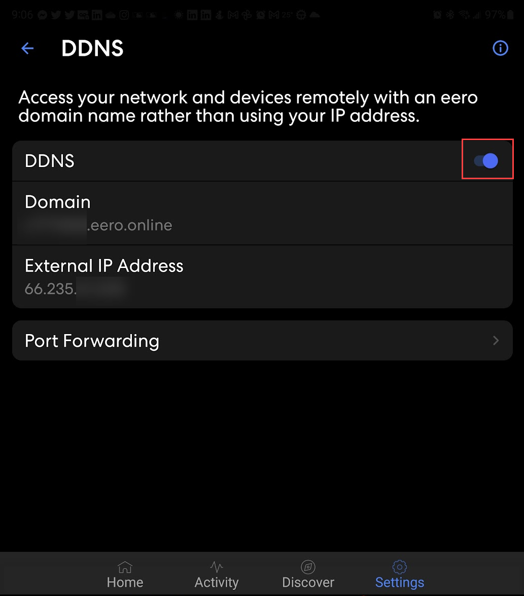
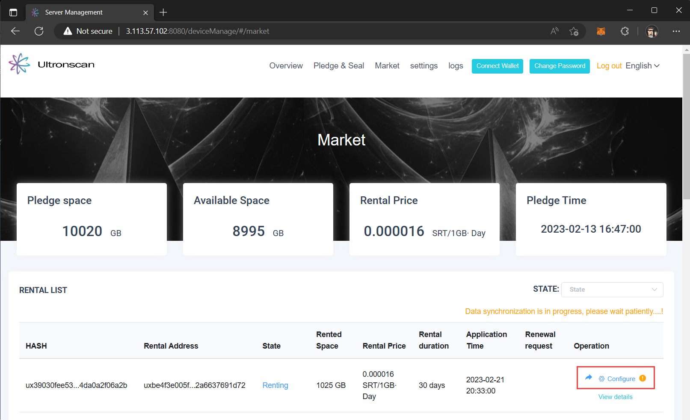
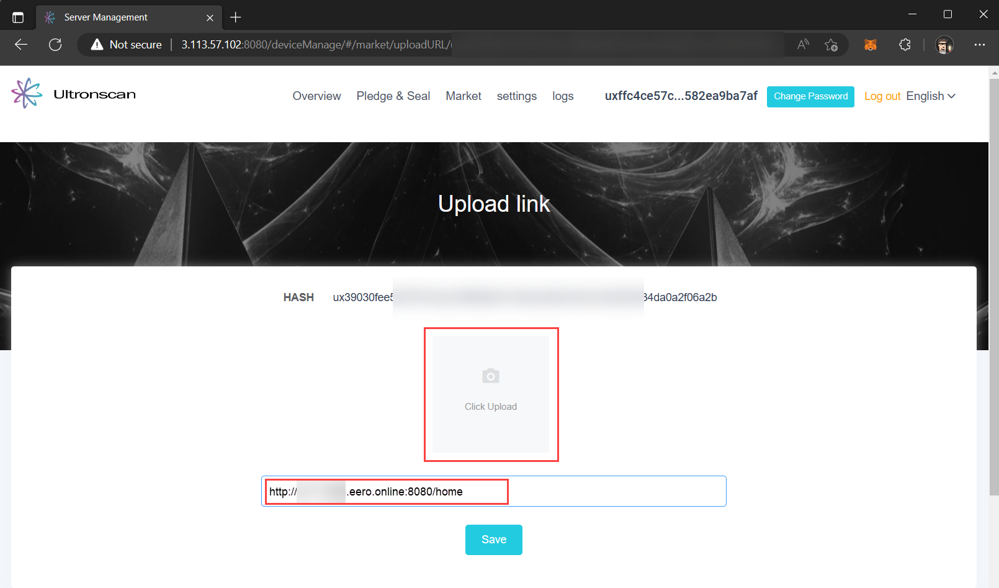

# Finalize Rental Agreement
---
After you have provided storage on the [UltronGlow Storage Market](https://www.ultronscan.io/market)
someone will rent your storage space.  Once they accept the rental terms, you must finalize your pledge
for the rental agreement and configure a link for the rente3 to be able to access their rented storage
space on your server.

This guide provides instructions for how to finalize the rental agreement and configuring the link for
the rentee.

## Prerequisites

* Complete the [Rent Storage on the UltronGlow Storage Marketplace](preparing-storage-for-rental.md) tutorial.

## Steps

### 1. Check if storage is rented

Navigate to [Ultronscan](https://www.ultronscan.io) and log into your storage server.

:::tip

If you forgot how to login to your storage server on UltronScan, refer to 
[Connecting to Ultronscan](connecting-to-ultronscan.md) for details

:::

1. Click on **Market**.

2. Check in the lower right-hand of the page under **Operation**.  If the status is listed as **Handle** with an 
   "**!**" next to it, click on it to confirm your pledge.
   
    If the status does show **Handle**, then wait for someone to rent your storage and come back and try again.

You will be asked to confirm your pledge.  

### 2. Configure port-forwarding on your router

You will now need to configure your router to enable the rentee to access your server to store their files.
While each router manufacturer has different user experiences for configuring port-forwarding, the below steps
will help you in general to determine the settings needed.

1. Determine the IP address of your server.
2. In your router's configuration, set-up port-forwarding to forward the IP address of your server to port 8080.
3. Enable DDNS (Dynamic DNS) to provide a unique hostname for the public IP address of your router.

In the below example, we are using an Eero mesh Wi-Fi router.  In the application to access the Eero router, the 
IP address is set for port-forwarding to port 8080.

### 3. Set URL for rentee access

You will see that since you completed your pledge in **Step 1**, that the **Operation** status has changed
**Handle** to **Configure** with an "**!**" next to it, indicating you need to set the URL for your rentee.

1.  Click on **Configure**

In the **Upload link** page, you are given an option to share an image of the URL address, or to provide a text
link directly.  In this example, we will use the text link.

1. Enter the URL link of the address based on the steps you completed in **Step 2** earlier.

:::note

The format of the link will be `http://<DDNS Hostname>:8080/home`

:::

Click the **Save** button, and you're done!

## Next Steps

Congratulations, you've successfully configured the storage for your rentee and they are now able to access
your server to store their files securely.

Continue on to the [**Next Step**](..%2Frent-storage-space%2Fget-started-renting.md)
to rent other's storage on the Storage Market where you can store your data for backup or other purposes!
