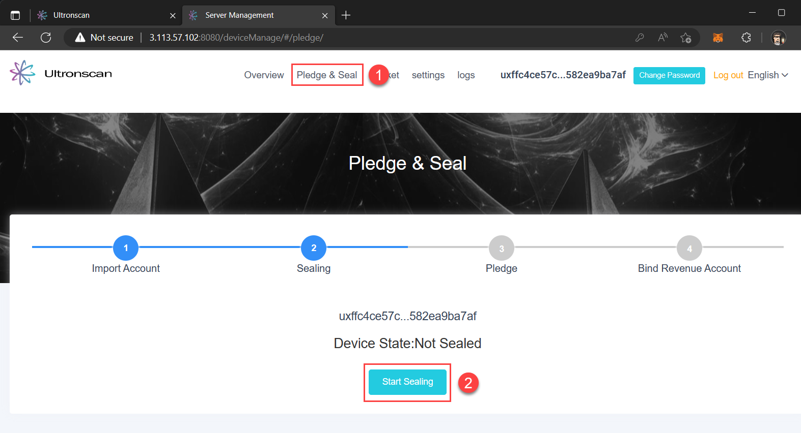
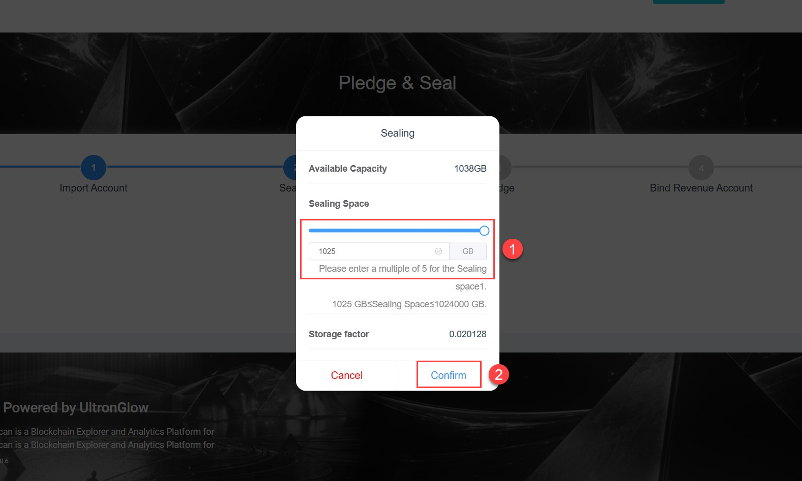
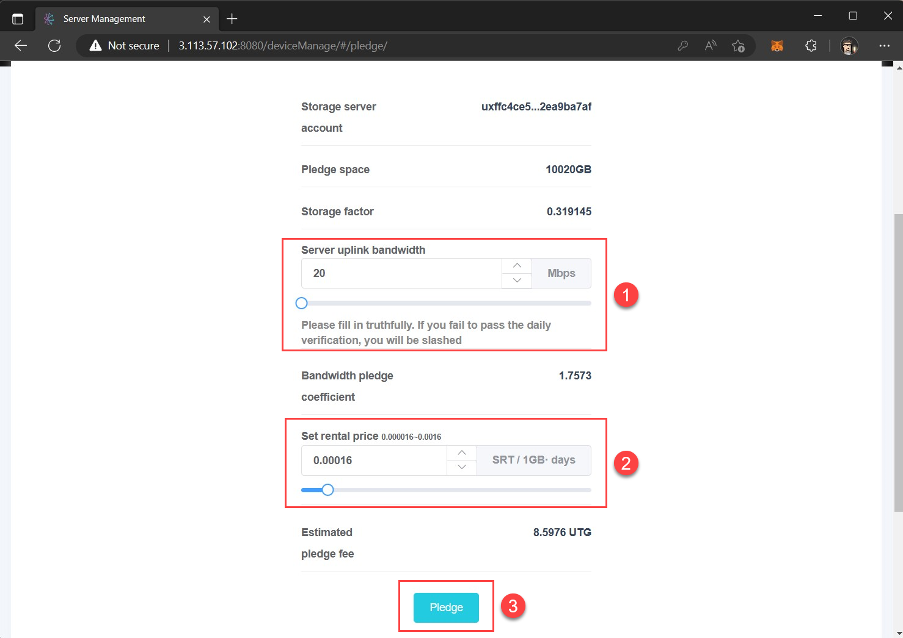
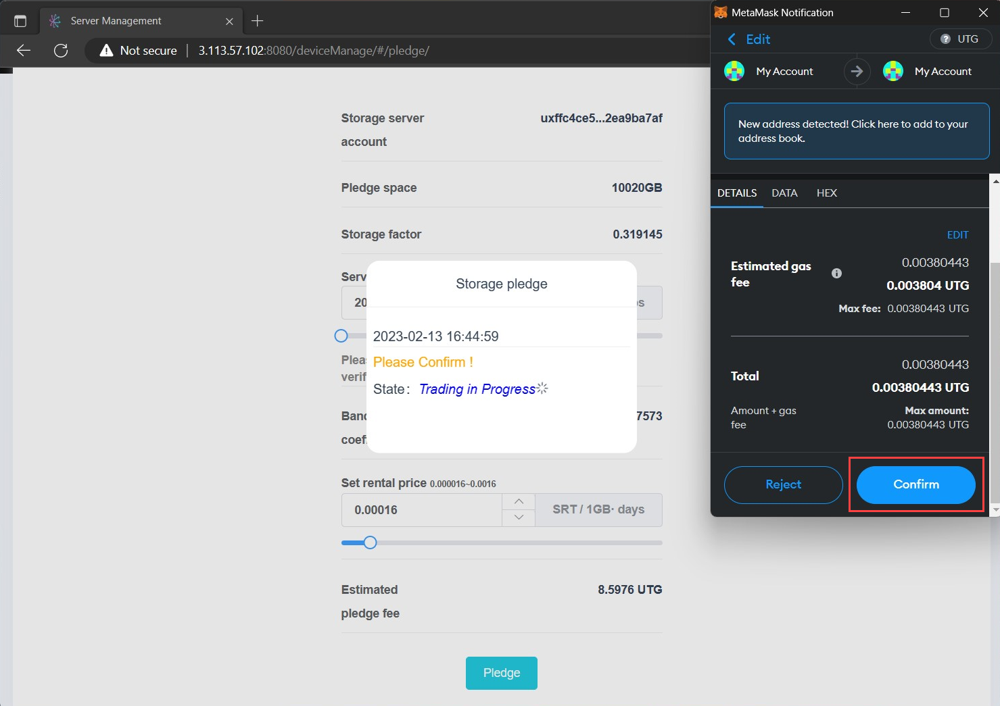
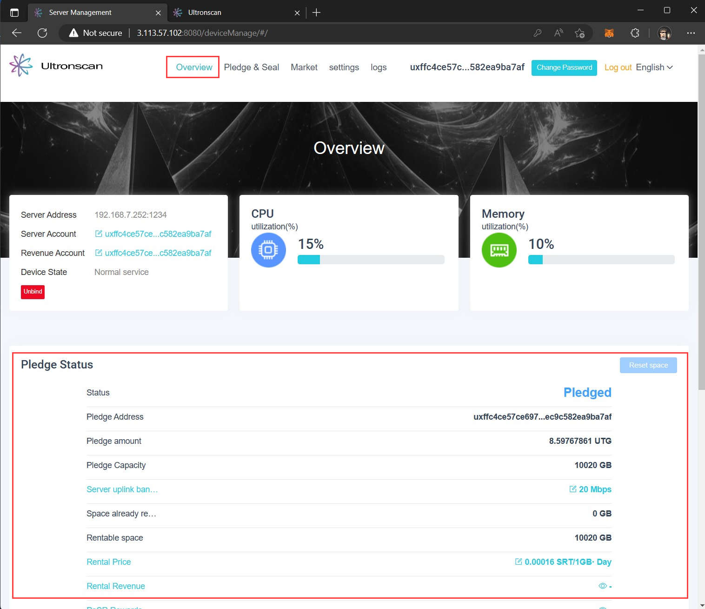

# Prepare & Rent Storage
---
In order to rent storage on the [UltronGlow Storage Market](https://www.ultronscan.io/market)
you will need to reserve a portion of your disk (seal) for rental.  Sealing sets apart the
amount of storage you select that will be encrypted when rented, and only accessible to the
renter. This ensures the renter's data is private and that you don't accidentally delete
it.

This guide provides instructions to seal a portion of your storage for rental on the Storage Market.

## Prerequisites

* Complete the [Connecting to Ultronscan](connecting-to-ultronscan.md) tutorial.

## Steps

### 1. Seal storage for rental

Navigate to [Ultronscan](https://www.ultronscan.io)

1. Click on **Tools**.

2. Click on **Storage Service Node Management**.

:::tip

If you forgot how to retrieve the IP address of your server, refer to **Step 1** in the
[Connect to Ultronscan](connecting-to-ultronscan.md) tutorial.

:::

In the **Server Management** tab in your browser that pops-up, start the sealing process by:

1. Click on **Pledge & Seal** in the top navigation bar of the site.

2. Click on the **Start Sealing** button.

1. Determine the amount of storage you want seal and make available for rent.

2. Click the **Confirm** button to start the sealing process.

:::info

Depending on how much storage you chose to seal, the sealing process can take a long time.  1 TB of storage sealing
can take up to 2 hours on a computer with a fast SSD, or longer if using a HDD.

:::

:::caution

During the sealing process, be sure not to reboot or turn off your server as this will cause the process to start over 
again once the server has rebooted.

:::

### 2. Set Rental Terms and Pledge

Once completed, click the **Next** button on Server Management page, which will then bring up a dialog asking you to
configure your bandwidth and rental settings.

1. Run a speed test to determine how much uplink bandwidth you have available.  

:::caution

The UltronGlow network will periodically test to see if the bandwidth you pledged is available.
Be sure to set the limit to an amount that factors in your daily usage.

:::

2. Set a rental price in **SRT** that you will charge for your storage rental.  It's helpful to consider what others
   are charging to determine a competitive rate.

3. Click the **Pledge** button to proceed to the next step.

A MetaMask prompt will appear asking you to confirm your transaction on the UltronGlow network.  

Click the **Confirm** button in MetaMask, and congratulations - your storage is now rented on the UltronScan Storage
Marketplace.

Once the transaction has confirmed on the network (which may take a minute or two), **Overview**,
found on the top navigation bar, is where you can view your Pledge is committed, the terms of the rental,
and rental status of your space.

## Next Steps

Congratulations, you've successfully sealed and rented your storage on the
[UltronGlow Storage Market](https://www.ultronscan.io/market)!  

Continue on to the [**Next Step**](finalize_rental_with_rentee.md) to see if someone has rented your storage
and configuring your server for them access and store files!