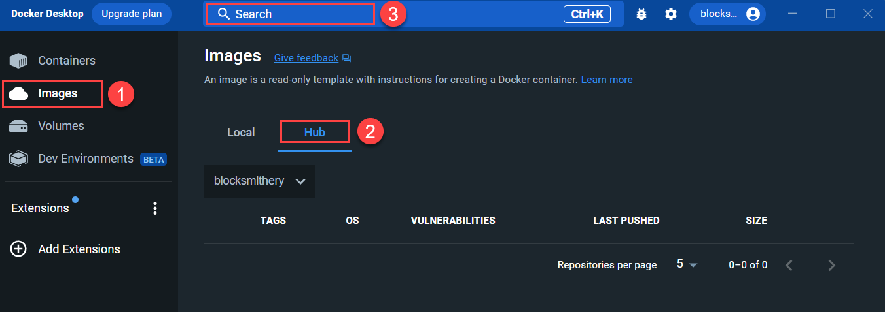
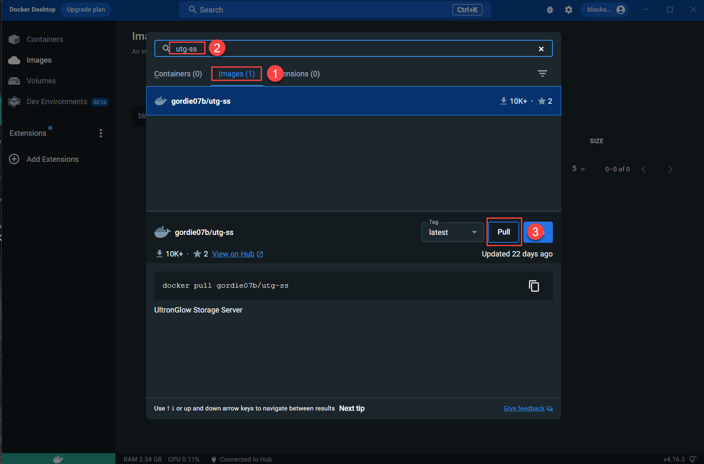
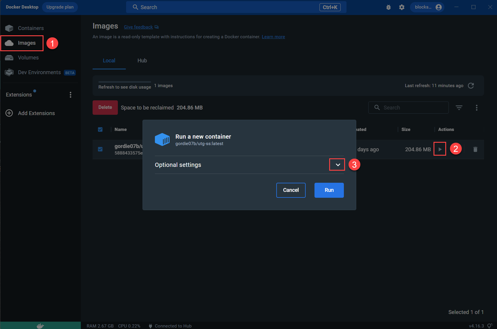
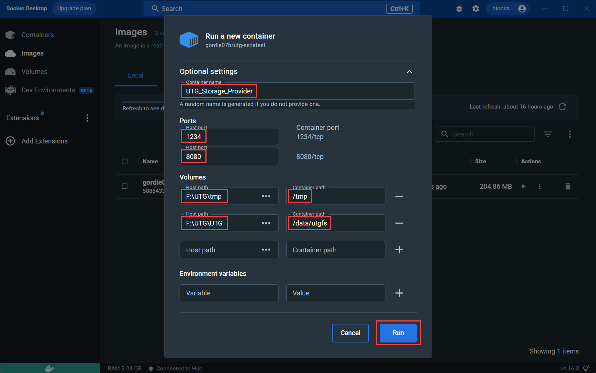
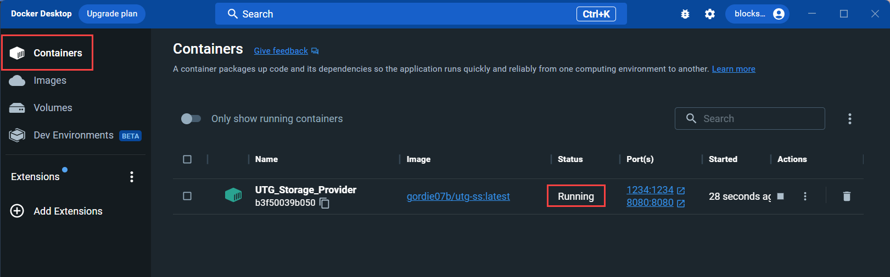

# Setting up your Device
---

Storage providers on the UltronGlow network utilize containerization technology to provide a
seamless way to configure storage for rental, as well as earning rewards for doing so.  

This guide provides instructions to configure **Docker Desktop**, find and download the UltronGlow container
from **DockerHub**, and configure the container appropriately for use on the UltronGlow network.

Before starting, make sure you have followed the below prerequisites in order to be successful.

## Prerequisites

* Complete the prerequisites in [Getting Started](get-started-storage-provider.md).

## Steps

### 1. Download the UltronGlow Storage Provider Docker image

Once you have Docker Desktop installed on your computer, you will host a container that will run the
UltronGlow Storage Provider services that facilitate sharing your storate on the network.

Open the **Docker Desktop** application on your computer.

1. Open **Images** in the left navigation bar.

1. Change from **Local** to **Hub** to search for the UltronGlow image in Docker Hub.

1. Click on the **Search** field.

1. Click on the **Images** tab to search for the image.

2. In the **Search** bar, type **utg-ss** to find the *gordie* image.

3. Once you find the image, click on the **Pull** button to download the image to your computer.

The image will take a few seconds to download to your computer.

### 2. Configure and run the Docker container

Once the image has downloaded successfully, you will configure the container for your computer
which will enable you to offer your storage resources on the [UltronGlow storage market](https://www.ultronscan.io/market/).

In Docker Desktop, do the following:

1. Click on **Images** on the left navigation pane.

2. Click on the **Run** button, which will bring-up the **Run a new container** dialog box.

3. Click on the **Optional Settings** dropdown button where you will configure the container.

The image will take a few seconds to download to your computer.  Once the image has downloaded
successfully, do the following:

1. Click on **Images** on the left navigation pane.

2. Click on the **Run** button, which will bring up the **Run a new container** dialog box.

3. Click on the **Optional Settings** dropdown button where you will configure the container as
   follows:

    * Enter a descriptive name for in the `Container name` field.  In this example, it is **UTG_Storage_Provider**.

    * In the `Host port` fields, enter **1234** and **8080** respectively.

    * In the **Host path** fields uner **Ports**, you will specify the location of the storage you
      want to share.

        * You will first need to create 2 subdirectories on the drive you are using to share storage,
          named *\tmp* and *\utg* respectively.
        * In `Host Path`, enter the path to the *\tmp* directory you created in the above step.
        * In `Container path`, enter */tmp*
        * Click on the **+** icon, which is located to the right of the path you just entered, which
          will create another `Host Path` and `Container path` line.
        * In the new `Host path` field, enter the path to the *\utg* directory you created earlier.
        * In the new `Container path` field, enter */data/utgfs*.

    * Click on the **Run** button to start your Storage Provider container.

1. Navigate back to **Containers** in Docker Desktop, and you'll see that your container is now
   running.

## Next Steps

Congratulations, you've successfully deployed your UltronGlow Docker image on your computer!
Continue on to the [**Next Step**](connecting-to-ultronscan.md) to connect your Docker image to **UltronScan**
and rent your storage on the Storage Market.
