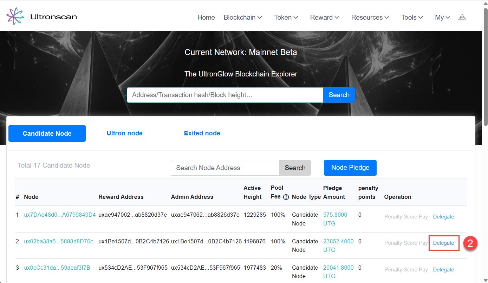
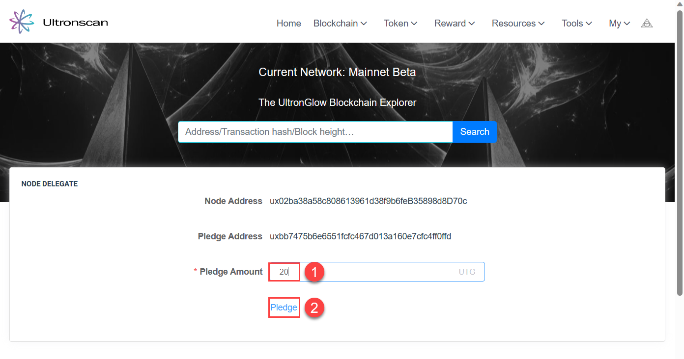
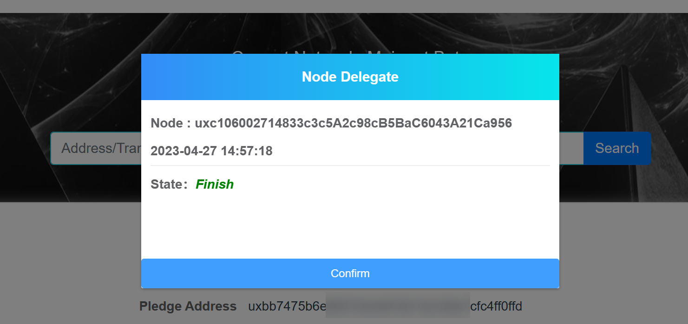
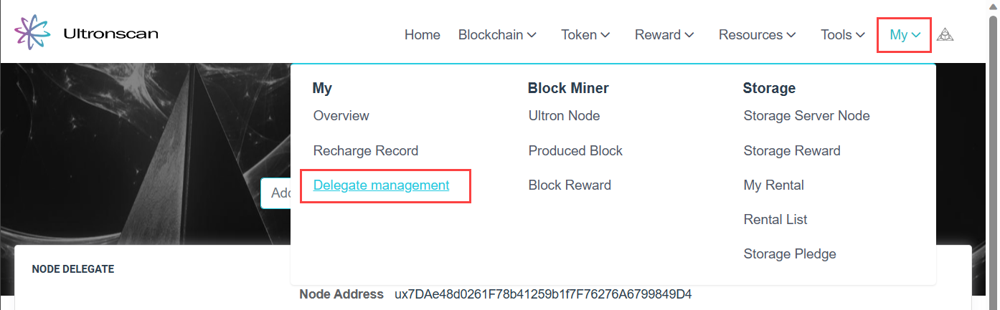

# Delegate
---

Once you have completed the [**prerequisites**](get-started-delegate-staking.md)

## Steps

### 1 - Delegate your pledge

1. Navigate to the [**Ultron Nodes section of UltronScan**](https://www.ultronscan.io/ultronnodes/).
2. Choose either an Ultron or Candidate node for delegating your stake, and click on **Delegate** on
   the line of the node you have chosen.

:::tip

Ultron nodes and candidate nodes both have opportunities to produce blocks on the network.  Choose either
an Ultron or candidate node that does not have a penalty score as nodes that have penalty scores >30 are not
eligible to product blocks on the network.  Read the
[**whitepaper**](https://ultronglow.cdn.prismic.io/ultronglow/d6314945-bd40-415f-897f-cd39b7522aa9_UltronGlow-Whitepaper.pdf)
for more details.

:::

3. In the new page that appears, enter the amount of UTG you want to pledge and click the **Pledge** link.

4. If prompted, connect the Metamask account where you are holding your UTG to Ultronscan.
5. Click the **Confirm** button to complete your pledge.

### 2 - Manage your delegate status

Now that you've completed your delegation, you can come back to Ultronscan at any time to see the status of your pledge.

1. Navigate to [**Ultronscan**](https://www.ultronscan.io).
2. Click on **My** and then **Delegate management**.

## More Resources

In addition to our documentation, check-out our other resources to help you learn more about
UltronGlow and connect with other UTG'ers!

* Join us on [**Telegram**](https://t.me/UltronGlowOfficial)
* Follow us on [**Twitter**](https://twitter.com/ultronglow)
* Join our community on [**Zealy**](https://zealy.io/c/ultronglow/questboard) and complete quests to earn rewards!
* Read the [**Whitepaper**](https://ultronglow.cdn.prismic.io/ultronglow/d6314945-bd40-415f-897f-cd39b7522aa9_UltronGlow-Whitepaper.pdf)
