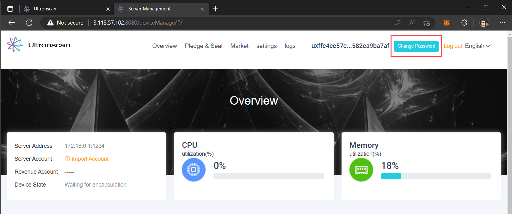

# FAQ
---

Not finding answers to all of your questions?  Hopefully our FAQ below helps point you in the right direction.  If not,
please answer in our Telegram and we'll get an answer for you ASAP (and update our docs!)

### How do I determine how much I can earn?
We've put together a fantastic [rewards calculator](https://www.ultronscan.io/rewards-calculator/) that allows you to
calculate the estimated rewards you can earn based on your rental terms.

### Where can I check the price of UTG?
You can UTG's current and historical pricing at [CoinMarketCap](https://coinmarketcap.com/currencies/ultronglow/)

### How do I exchange UTG for SRT?
You can exchange UTG for SRT by accessing your [recharge record](https://www.ultronscan.io/mymanage/paylog) 
on Ultronscan after by logging in with the MetaMask account you configured for your storage server.

### What is the conversion rate of UTG to SRT?
The conversion rate of UTG to SRT fluctuates based on the UTG price, outlined in the
[UltronGlow whitepaper](whitepaper.md). To check the current rate of conversion, go to the 
[paylog](https://www.ultronscan.io/mymanage/paylog) section on Ultronscan.

### What are the HW requirements to become a Storage Provider?
To become a Storage Provider on the UltronGlow networking, your computer must have the following capabilities:
* A minimum of 1 TB of space available for rental.
* Sufficient system resources to host the UltronGlow Docker container.
* 500 MB of disk space for the utg-ss container image.  
* 2 GB of RAM dedicated for the container to run.
* A minimum of 20 mbps uplink speed for your internet connection.

### I can’t log in to my Storage Server on UltronScan?
Check [this](..%2Ftroubleshooting%2Fultronscan-not-connecting-to-server.md)
troubleshooting article for things you can try to address this.

### How do I change the login password on UltronScan?
After [logging into your storage server](..%2Fbecome-a-storage-provider%2Fconnecting-to-ultronscan.md), 
click on the **Change Password** button in the upper-right corner of the Ultronscan website.

### How can I see what Storage Providers are available for rent?
See the [Ultronscan Storage Market](https://www.ultronscan.io/market/) for a current list of Storage Providers
offering storage for rent.

### How do I configure MetaMask for UltronGlow?
See our [quick guide](https://www.ultronscan.io/metamask/) on how to connect MetaMask to the UltronGlow network. 
