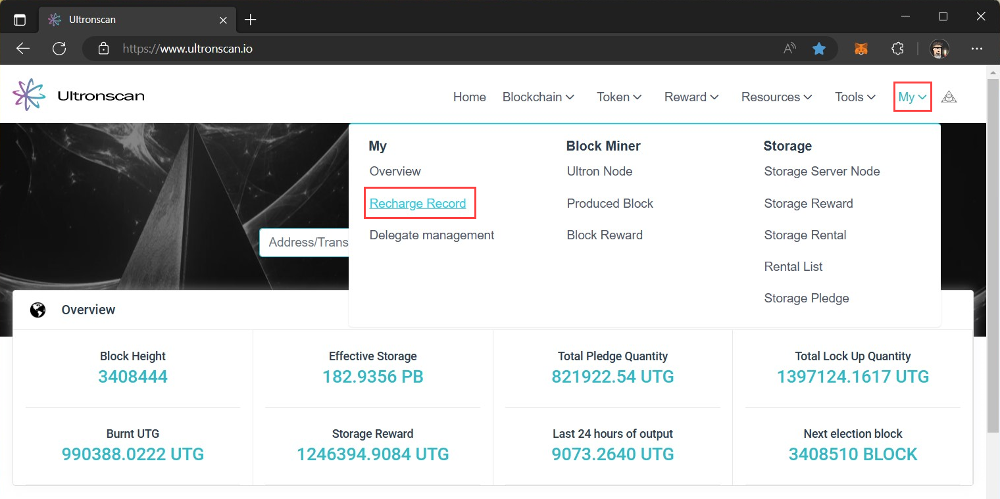
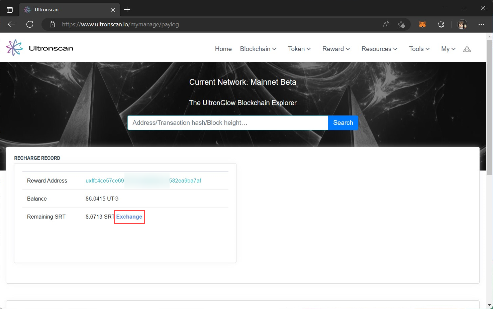
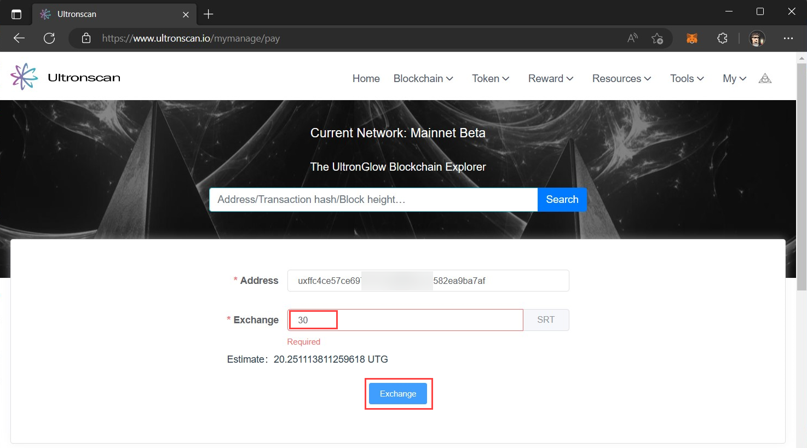
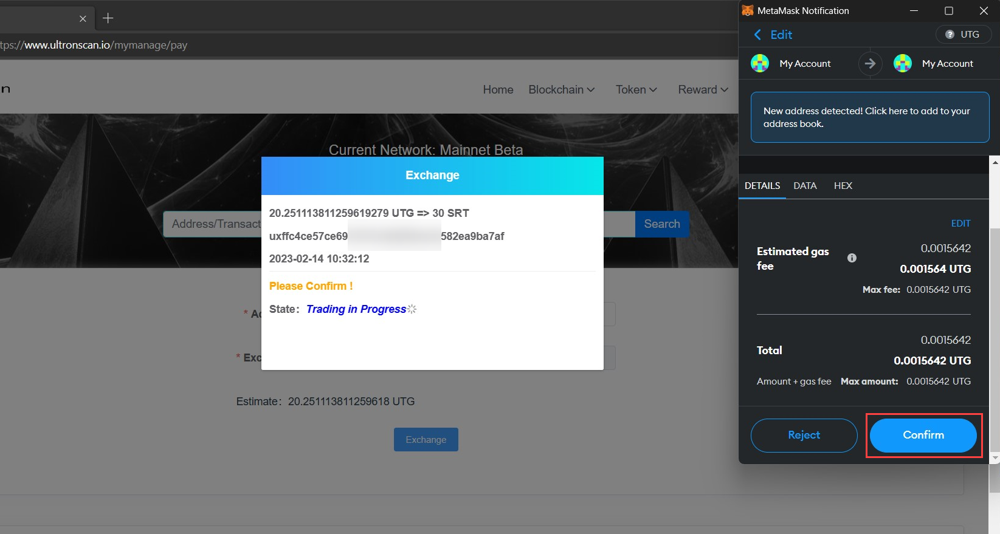
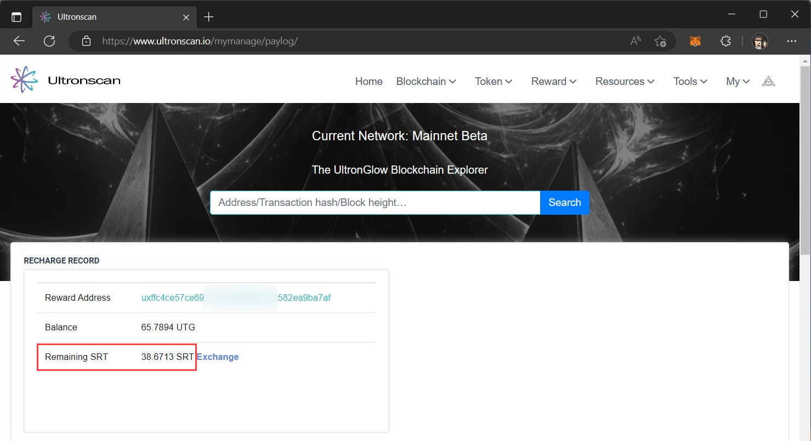

# Get SRT to Rent Storage
---

Renting storage space on the [**UltronGlow Storage Market**](https://www.ultronscan.io/market/) is done by obtaining
SRT (Storage Resource Token).  SRT is a credit which is used exclusively for renting storage, and is designed such
that once you exchange UTG for SRT, the price of SRT remains constant.  This avoids the problem of the potentially
fluctuating price of UTG during a rental agreement.

For example, if you convert the equivalent of $10 of UTG into SRT, that SRT is guaranteed to be worth $10 of services
on the Storage Market.  As you enter a rental agreement, you can rest assured that the actual price of your rental
will not fluctuate as the the price of UTG changes over time.

This tutorial will guide you through the steps to convert a portion of your UTG over to SRT to start renting storage.

## Steps

### 1 - Recharge your SRT

1. Navigate to the [**UltronScan**](https://www.ultronscan.io/).
2. Click on **My** in the top-right corner of UltronScan, and then click on **Recharge Record** in the menu dropdown.

In the page that appears, you will see how much UTG you have in your MetaMask account next to **Balance**, and what
your remaining SRT is (which should be 0) next to **Remaining SRT**.

1. Click on the **Exchange** link next to your Remaining SRT

1. In the **Exchange** field, enter the amount of SRT you'd like to exchange.
2. Click on the **Exchange** button to initiate transfer.

This will initiate the exchange which will prompt a MetaMask transaction to occur.  

Click the **Confirm** button in MetaMask transaction and wait for the dialog on UltronScan says it's complete
and then dismiss the window.

### 2 - Confirm your SRT Balance

1. Navigate to the [**UltronScan**](https://www.ultronscan.io/).
2. Click on **My** in the top-right corner of UltronScan, and then click on **Recharge Record** in the menu dropdown.

In the page that appears, you will see that your **Remaining SRT** is now updated!

## More Resources

In addition to our documentation, check-out our other resources to help you learn more about
UltronGlow and connect with other UTG'ers!

* Join us on [**Telegram**](https://t.me/UltronGlowOfficial)
* Follow us on [**Twitter**](https://twitter.com/ultronglow)
* Join our community on [**Zealy**](https://zealy.io/c/ultronglow/questboard) and complete quests to earn rewards!
* Read the [**Whitepaper**](https://ultronglow.cdn.prismic.io/ultronglow/d6314945-bd40-415f-897f-cd39b7522aa9_UltronGlow-Whitepaper.pdf)

## Next Steps

Now that you have recharged your SRT balance, you're ready to start renting storage from the Marketplace!
Continue on to the [**Next Step**](rent-storage.md) to get started.