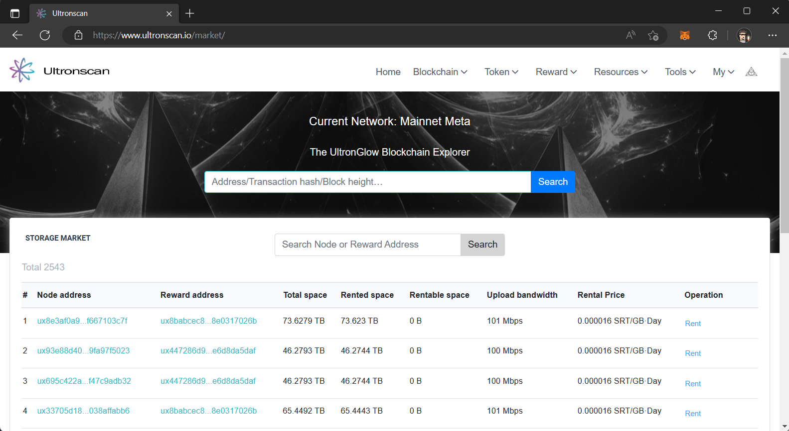

# Getting Started
---

Participating in [**UltronGlow**](https://www.ultronglow.io) does not require you to host your own Validator
or Storage Provider.  You can rent storage from others on the
[**UltronGlow Storage Market**](https://www.ultronscan.io/market/) which provides thousands of nodes to rent
storage.  

Whether you want a location to share files with others, or backing up your data from your computer,
renting storage is a great alternative to centralized storage providers providing you the option to choose
how much storage you want to rent at the price you are willing to pay.

## Prerequisites

* Purchase UltronGlow's native token, UTG, from
  [**Hotcoin Global**](https://www.hotcoin.com/) or [**Bitmart**](https://www.bitmart.com/) and transfer your UTG
  to your MetaMask wallet.

:::note

You will have to purchase USDC or USDT on either exchange first, and then convert it to UTG.

:::

## More Resources

In addition to our documentation, check-out our other resources to help you learn more about
UltronGlow and connect with other UTG'ers!

* Join us on [**Telegram**](https://t.me/UltronGlowOfficial)
* Follow us on [**Twitter**](https://twitter.com/ultronglow)
* Join our community on [**Zealy**](https://zealy.io/c/ultronglow/questboard) and complete quests to earn rewards!
* Read the [**Whitepaper**](https://ultronglow.cdn.prismic.io/ultronglow/d6314945-bd40-415f-897f-cd39b7522aa9_UltronGlow-Whitepaper.pdf)

## Next Steps

Ready to start storing your data on the UltronGlow decentralized storage network?
Continue on to the [**Next Step**](rent-storage.md) to start renting storage today!