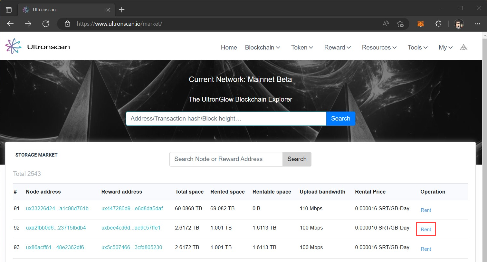
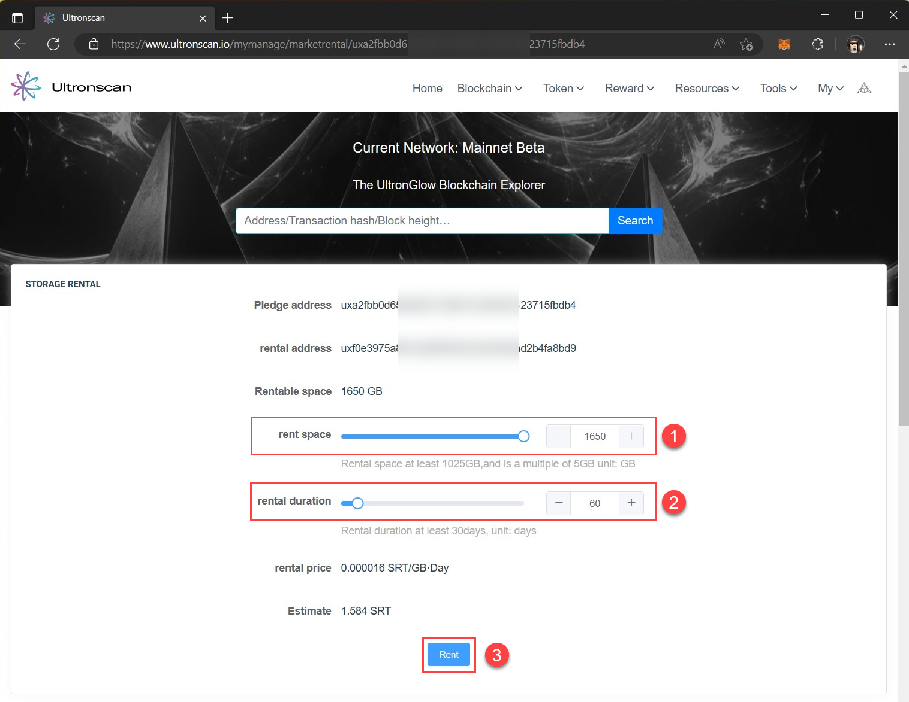
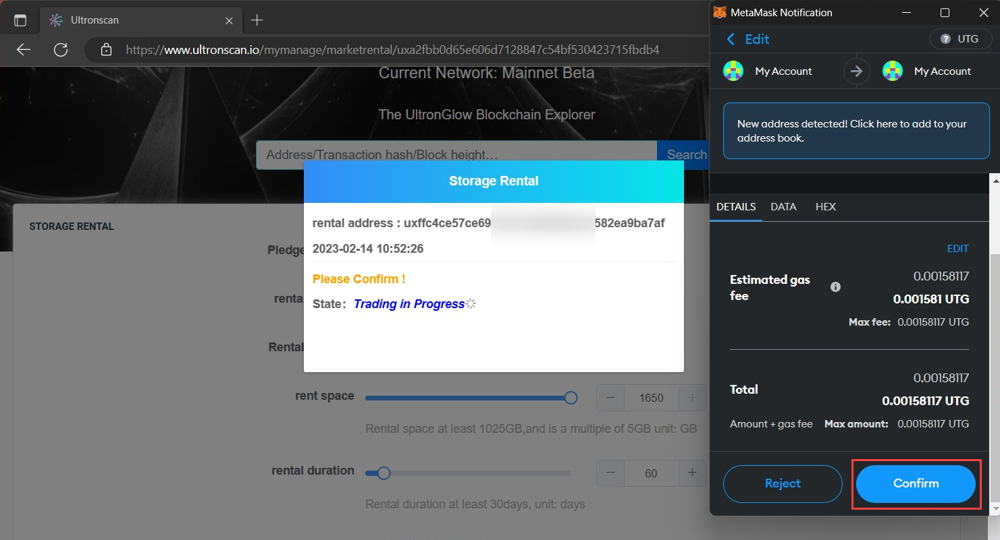
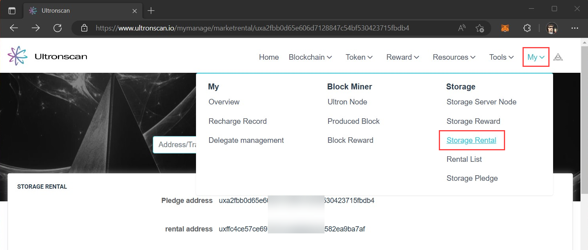
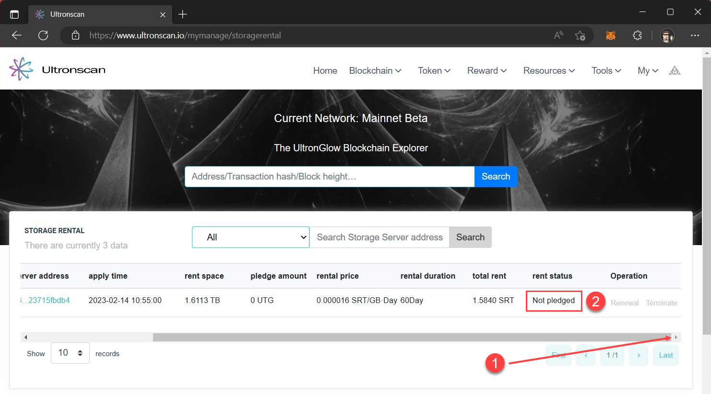
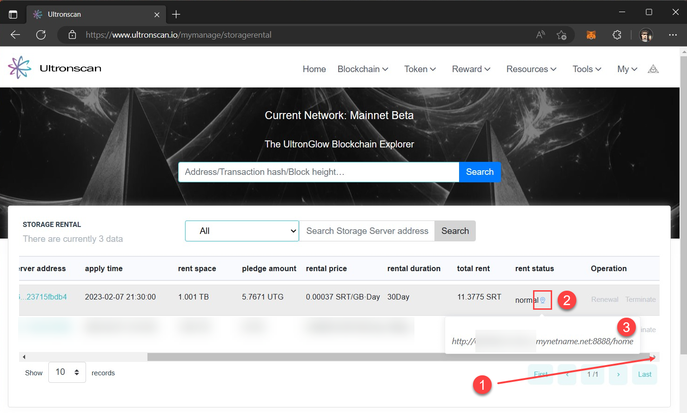
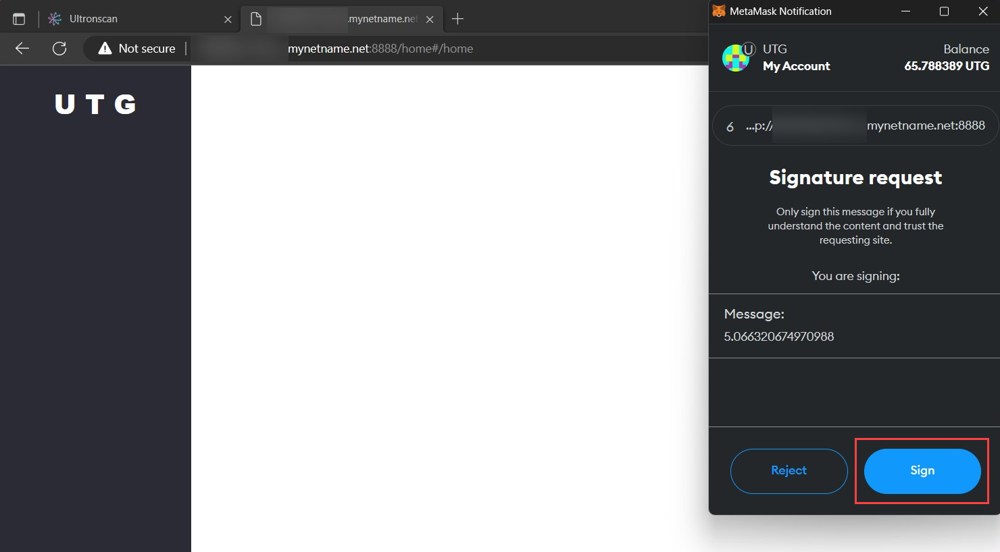
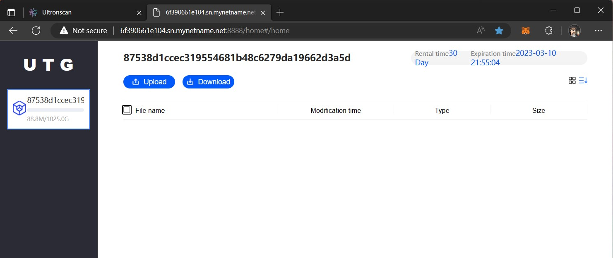

# Rent Storage on UltronGlow Marketplace
---

Renting storage on the [**UltronGlow Storage Market**](https://www.ultronscan.io/market/) uses smart contracts on the
UltronGlow blockchain to form a rental agreement between you, and the Storage Provider who you will be renting the
storage from.  This establishes a transparent, binding agreement between you (the Rentor) and the Storage Provider
(the Rentee) on terms for storage rental, such as:

* The price of the storage to be rented
* The length of the rental contract
* Penalties if the Rentee fails to provide storage resources per the term of the rental contract

Once you enter a rental contract, the Rentee will process (agree) to the contract, and provide you with a link to
access the rented storage, which can only be accessed by you through your MetaMask account.

This tutorial will guide you through the steps to find a Rentee to enter a rental agreement with, renting their storage
and how you wil subsequently access the storage for usage.

## Prerequisites

* Complete the [Get SRT to Rent Storage](get-srt.md) tutorial as you'll need SRT to rent storage.

## Steps

### 1 - Find Storage to Rent

1. Navigate to the [**UltronGlow Storage Market**](https://www.ultronscan.io/market/).
2. Search through the list of available Storage Providers and choose one that fits your needs for the amount of storage
   you want and the amount you are willing to pay.
3. Click the **Rent** link next to their listing.




### 2 - Rent Storage

This will bring you to the **Storage Rental** page, which will give you the options to determine how much of the
Storage Providers space you want to rent, for how long you want to rent their storage, and the associated price of the
rental based on the selected terms.

1. In the **rent space** section, move the slider, or type the amount in the textbox, of the amount of storage you would
   like to rent.
2. In the **rental duration** section, move the slider, or type the number of days that you would like to rent the
   selected storage.
3. Click the **Rent** button.

 

This will bring-up a MetaMask prompt to confirm the transaction on the UltronGlow network.

1. Click on the **Confirm** button in MetaMask.
2. Wait for the transaction to complete and dismiss the dialog.



### 3 - View Rental Agreement 

Once the transaction has completed on the UltronGlow network, you can view the status of the agreement on UtlronScan.

1. Click on **My** in top-right corner of the UltronScan website.
2. Click on **Storage Rental**.



In the **Storage Rental** page, you will see the status of the rental agreement.

1. **Scroll** to the far right of the window in order to see the last few columns.
2. Note the **rent status** is listed as ```Not pledged```.



At this stage, the Storage Provider you rented from needs to confirm the agreement on their side and provides you
with a link to access your rented storage.  Since this is a manual action on the Storage Provider's part, this could
take some time as they need to respond to the rental request.

### 4 - Access your Rented Storage
Once the Storage Provider has finalized the agreement, you will be able to go back to the **Storage Rental** page.

1. **Scroll** to the far right of the window in order to see the last few columns.
2. Note the **rent status** is listed as ```normal```.  **Hover** your mouse cursor over the location icon.
3. **Copy** the URL that shows-up below the location.



In a new browser tab, paste in the URL you copied from the previous step.

This will bring-up MetaMask prompt for you to access your storage.  By connecting the storage location to your
MetaMask account, only **you** have access to this storage location as the rental agreement is tied to this account.

1.  Click the **Confirm** button in MetaMask to authenticate and access your storage space.



The interface of your storage space should be very familiar if you've ever used a browser to upload or download files,
such as Google Drive or Microsoft OneDrive.



## More Resources

In addition to our documentation, check-out our other resources to help you learn more about
UltronGlow and connect with other UTG'ers!

* Join us on [**Telegram**](https://t.me/UltronGlowOfficial)
* Follow us on [**Twitter**](https://twitter.com/ultronglow)
* Join our community on [**Zealy**](https://zealy.io/c/ultronglow/questboard) and complete quests to earn rewards!
* Read the [**Whitepaper**](https://ultronglow.cdn.prismic.io/ultronglow/d6314945-bd40-415f-897f-cd39b7522aa9_UltronGlow-Whitepaper.pdf)

## Next Steps

Congratulations!  You've successfully recharged your SRT record, found a Storage Provider to rent storage from, completed
the rental agreement and accessed your storage!

There's much more coming from the UltronGlow team to improve the experience and capabilities of the network.  Keep an
eye out on [our latest news](https://ultronglow.io/latest-news/) as we continue down the journey of bringing decentalized
storage to the world!