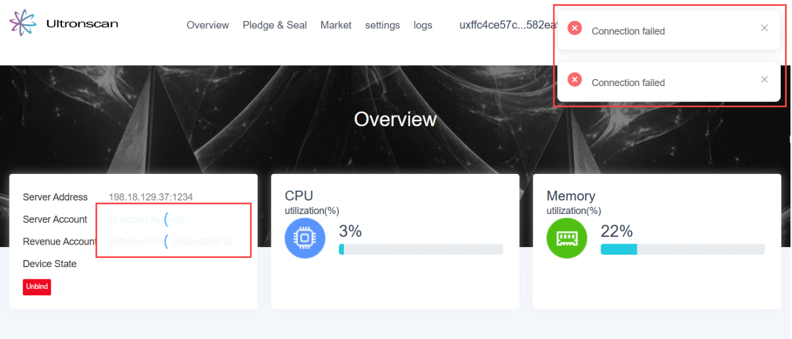
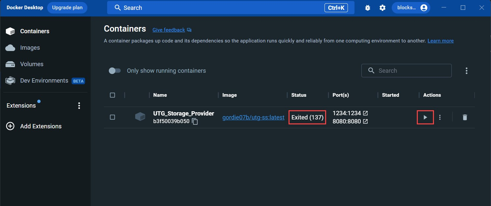

# Ultronscan cannot connect
---
If UltronScan is not able to connect to your server, there can be a few problems that are easy to check
and address.  The below is an example of when UltronScan cannot connect to your server - specifically
that the **Server Account** and **Revenue Account** fields will be blank, and periodically in the upper
right-hand corner of the screen, a **Connection failed** error message will appear.

## Tip 1 - Check IP Address

The IP address of your Docker container may change due to intermittent connectivity, or shutting down and restarting
either your Docker container or your server.  To address this, try the following:

1. Log out of UltronScan.
2. Verify the IP address of your Docker container.

:::tip

If you forgot how to retrieve the IP address of your server, refer to **Step 1** in the
[Connect to Ultronscan](..%2Fbecome-a-storage-provider%2Fconnecting-to-ultronscan.md) tutorial.

:::

3. Log back into UltronScan.

## Tip 2 - Check if container is running

Your Docker container image may not be configured to auto-restart in the event that it shuts down unexpectedly.
If your Docker container is not running, UltronScan cannot connect to it.  To address this, try the following:

1. Open Docker Desktop.
2. Open the **Container** section.
3. Ensure the container is not stopped by checking the **Status** column.  If it is stopped (Exited), then click
   the start icon in the **Actions** column.
4. Once the Docker container is in a running state, try logging into UltronScan again.

